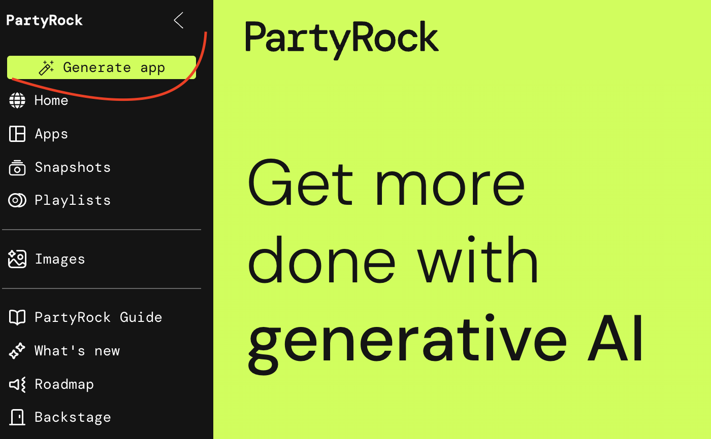
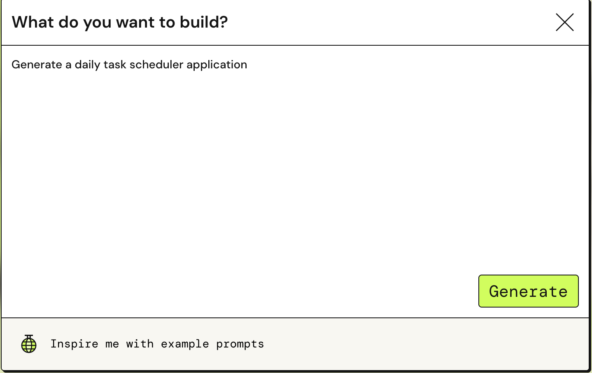
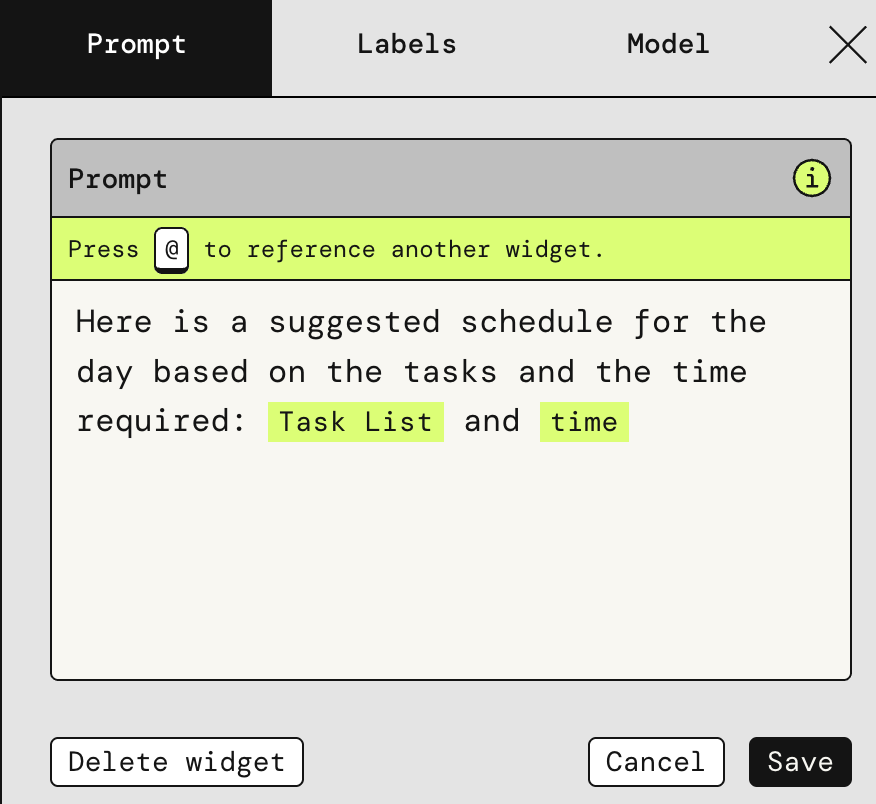
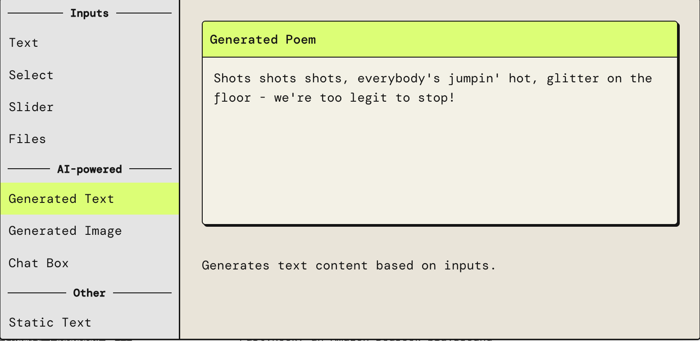
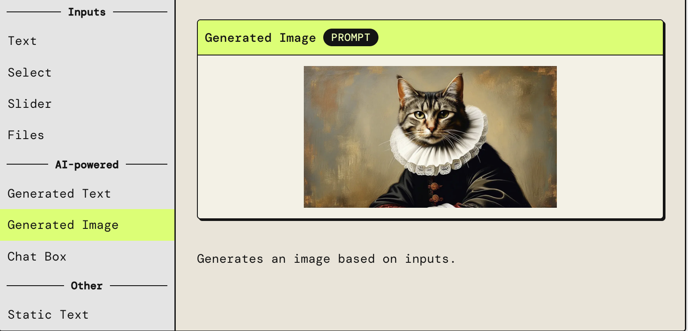

# Daily task scheduler application using Amazon PartyRock

Build your own daily scheduler application using Amazon PartyRock

## Overview

I will build a "Daily Task Scheduler Application" using Amazon PartyRock, a new AWS platform that leverages generative AI to make app development easier. If you're not familiar with PartyRock, it’s designed to help streamline the creation of applications with minimal effort.

In the next few steps I will be going through this steps:
 - Generating the application
 - Changing existing widgets
 - Adding new widgets
 - Publishing my application

## How to start?

1. Visit: https://partyrock.aws/  (crate an account if you already don't have one)
2. Generate your first application by clicking "Generate  app" button

     

3. Type in the box: "Generate a daily task scheduler application"

     

4. Click "Generate" and see the magic!

**PartyRock** generated an application to help you manage your day.

## Modify existing widgets

1. In edit mode of your application you can resize the block by clicking and dragging the bottom right corner of the block, so be creative!
2. If you wish to edit your widget just click on edit option of the block in the top right corner. 
3. In the Edit section of "Schedule widget", you can see multiple models available. You can choose one of these models to generate outputs basen on how well generated you want it to be. 
4. The "Prompt" section in the Edit "Schedule widget" panel is used to provide input to the model that guides the generated output. You can reference another widget within the prompt by using @widget_name.

## Adding new widgets

1. To add new widget click on "+ Add widget" on the top of your screen. From the list choose an user input widget "Text".
2. You can custom your widget by changing the name and placeholder.
3. Let's give this widget as an input for preparation of schedule. You can change the prompt to enter the time required for each task.

     

4. Save and check new schedule. 
5. Try and add a motivation quote widget to generate a motivational quote and a photo generator to generate a motivational image and get you started with your day. For that use AI-powered options: Generated Text and Generated Image. 

     
     

6. Remember that you can be creative and add or change widgets as much as you want! 

## The Importance of a Detailed Prompt

Prompt engineering plays a crucial role in effectively using PartyRock. To achieve the best possible results, it is essential to craft prompts that are both clear and detailed, aligning closely with our specific needs. 

## Cleaning up

When you are done playing with PartyRock proceed to do a clean-up and delete your application. Navigate to "Apps" and click on "Delete" icon of your app.
